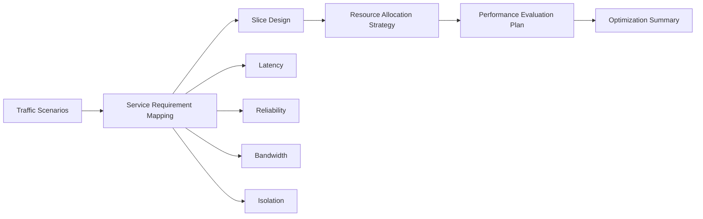

# 5G Network Slicing for Intelligent Transportation

## Overview

A research case study on applying 5G network slicing concepts to intelligent transportation scenarios, focusing on latency, reliability, bandwidth allocation, slice isolation, and performance optimization strategy.

## Motivation

Intelligent transportation systems contain heterogeneous communication needs. Safety-related messages, traffic monitoring, vehicle-road coordination, video streams, and user-facing services do not need the same latency, reliability, bandwidth, or isolation guarantees. Network slicing provides a framework for reasoning about differentiated resource allocation instead of one-size-fits-all networking.

## Features

- Intelligent transportation scenario analysis.
- Communication requirement mapping for low-latency, high-reliability, and high-bandwidth services.
- Network slice definition for safety, monitoring, control, and infotainment-style traffic.
- QoS constraint modeling across latency, bandwidth, reliability, and isolation.
- Resource allocation trade-off analysis.
- Performance optimization strategy summary.
- Public-safe explanation of networking concepts for software and algorithm discussions.
- Disclosure boundary that avoids claiming live deployment or measured improvement without public evidence.

## Tech Stack

This public folder is an academic / algorithm research brief. It does not include a live network deployment, private dataset, or production simulation code.

| Area | Current / Intended Technology |
|---|---|
| Documentation | Markdown, Mermaid |
| Research method | Scenario analysis, constraint modeling, optimization reasoning |
| Modeling concepts | QoS, latency, bandwidth, reliability, resource isolation, slice priority |
| Algorithm direction | Heuristic allocation, constrained optimization, simulation-based comparison |
| Testing direction | Synthetic traffic scenarios, baseline comparison, constraint satisfaction checks |

## Architecture



### Module Notes

- `Traffic Scenarios`: safety messages, roadside monitoring, video streams, navigation, and passenger services.
- `Requirement Mapping`: maps each scenario to QoS and isolation constraints.
- `Slice Design`: groups traffic into logical slices based on requirements.
- `Allocation Strategy`: reasons about priority, capacity limits, and trade-offs.
- `Evaluation Plan`: defines synthetic workloads, baselines, and metrics for future experiments.

## Project Structure

```text
5g-network-slicing-its-optimization/
├── README.md          # Public academic / algorithm case study
├── .env.example       # Safe placeholder configuration for future simulations
└── assets/            # Diagrams, charts, or synthetic simulation screenshots to be added later
```

## Getting Started

This folder can be reviewed locally as a research brief:

```bash
git clone https://github.com/Wendy-James/project-briefs.git
cd project-briefs/case-studies/5g-network-slicing-its-optimization
open README.md
```

For a future runnable version, start with a synthetic traffic generator and compare a static allocation baseline with a simple priority-aware allocation strategy.

## Environment Variables

No real credentials are required for the current public brief. Use `.env.example` only as a safe template for future simulation experiments.

```bash
cp .env.example .env
```

Do not commit private datasets, unpublished experiment files, or credentials.

## Testing

Current public artifact:

```bash
markdownlint case-studies/5g-network-slicing-its-optimization/README.md
```

Recommended implementation tests:

- Constraint validation for latency, bandwidth, reliability, and slice isolation.
- Synthetic scenario tests for different traffic mixes.
- Baseline comparison tests for static allocation versus priority-aware allocation.
- Sensitivity analysis over traffic load, slice priority, and capacity constraints.
- Documentation checks that separate research assumptions from measured results.

## Demo

- Chart: `assets/slice-allocation-demo.png` (to be added)
- Diagram: the Mermaid architecture above can be rendered by GitHub.
- Current demo status: no live transportation deployment or measured performance improvement is claimed in this public brief.

## My Role

Wendy / 詹文婷 worked on the research framing and communication of the 5G network slicing application scenario: mapping intelligent transportation needs to networking constraints, reasoning about resource allocation trade-offs, and documenting optimization strategy without overstating deployment or benchmark results.

## Future Improvements

- Add a synthetic traffic scenario table with latency, reliability, bandwidth, and priority fields.
- Add a small simulation script for comparing allocation strategies.
- Add charts for resource usage, SLA violation rate, and latency distribution.
- Add baseline and heuristic strategy descriptions.
- Add a limitations section that separates assumptions, simulation scope, and real-world deployment constraints.
