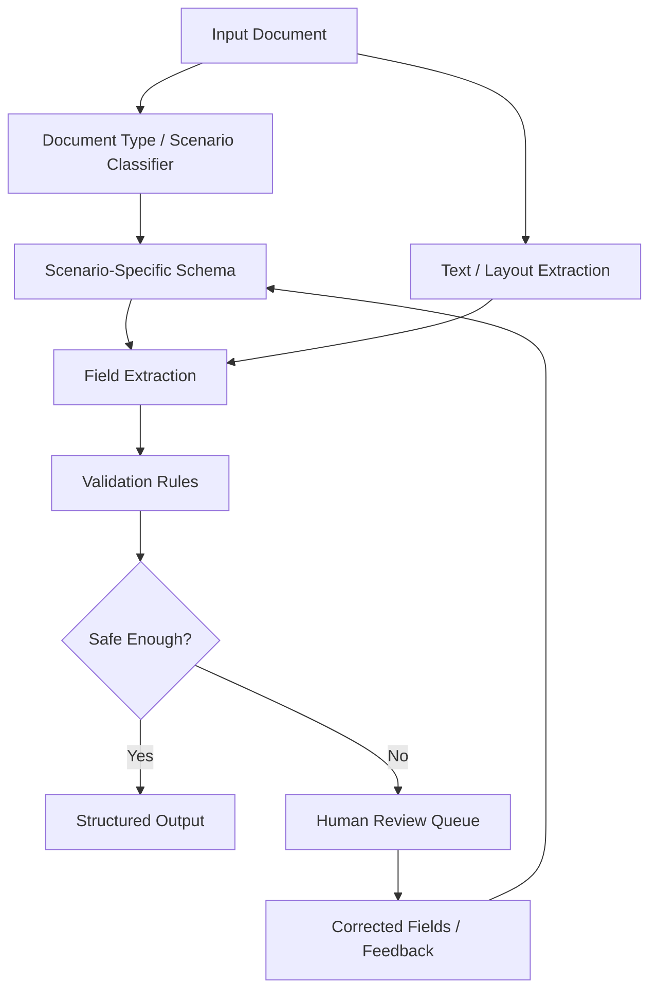

# Adaptive Document Structuring Model

## Overview

A document intelligence research project focused on adapting structured extraction schemas to different document scenarios, field definitions, validation needs, and manual review requirements.

## Motivation

Real documents are rarely uniform. Even when two files look similar, downstream users may care about different fields, confidence thresholds, validation rules, and review workflows. This project frames document structuring as an adaptive modeling problem: define what should be extracted, explain why it matters, and decide when the system should ask for human review.

## Features

- Multi-scenario document requirement analysis.
- Field schema design for common fields and scenario-specific fields.
- Extraction workflow decomposition from raw document to structured output.
- Validation rule design for required fields, type checks, consistency checks, and low-confidence cases.
- Error category analysis for missing fields, ambiguous fields, conflicting values, and layout-driven failures.
- Human review checkpoints for documents that cannot be safely auto-structured.
- Public disclosure boundary for research materials, private documents, and unsupported metrics.
- Interview-ready explanation of how document intelligence differs from simple text generation.

## Tech Stack

This public folder is a research and documentation artifact. It does not include private datasets, unpublished source code, or a production extraction service.

| Area | Current / Intended Technology |
|---|---|
| Documentation | Markdown, Mermaid |
| Research method | Requirement analysis, schema design, validation rule design, error taxonomy |
| Data modeling | JSON-style extraction schemas, confidence fields, review status fields |
| Document intelligence direction | OCR / layout parsing / LLM extraction can be integrated in a future implementation |
| Testing direction | Synthetic document fixtures, schema validation, field-level error analysis |

## Architecture



### Module Notes

- `Scenario Classifier`: decides which document schema and validation rules apply.
- `Schema Layer`: defines required fields, optional fields, field types, and confidence requirements.
- `Extraction Layer`: converts document content into candidate structured fields.
- `Validation Layer`: checks completeness, type consistency, conflicts, and low-confidence outputs.
- `Review Layer`: routes uncertain or high-risk documents to human review.

## Project Structure

```text
adaptive-document-structuring-model/
├── README.md          # Public research and engineering case study
├── .env.example       # Safe placeholder environment configuration
└── assets/            # Diagrams, screenshots, or synthetic examples to be added later
```

## Getting Started

This public folder is intended for review as a research case study:

```bash
git clone https://github.com/Wendy-James/project-briefs.git
cd project-briefs/case-studies/adaptive-document-structuring-model
open README.md
```

For a future runnable implementation, start with synthetic documents and a small schema validator before connecting OCR, layout parsing, or model APIs.

## Environment Variables

No real credentials are required for the current public brief. Use `.env.example` as a safe template for future experiments only.

```bash
cp .env.example .env
```

Do not commit private datasets, unpublished research documents, real OCR service keys, or model API keys.

## Testing

Current public artifact:

```bash
markdownlint case-studies/adaptive-document-structuring-model/README.md
```

Recommended implementation tests:

- Schema validation for each document scenario.
- Synthetic fixture tests for missing, ambiguous, and conflicting fields.
- Field-level accuracy checks on public or synthetic documents.
- Manual review routing tests for low-confidence and high-risk extraction results.
- Regression tests for schema changes across multiple document types.

## Demo

- Screenshot: `assets/schema-demo.png` (to be added)
- Diagram: the Mermaid architecture above can be rendered by GitHub.
- Current demo status: public material describes the research method and planned extraction pipeline; no private document examples are included.

## My Role

Wendy / 詹文婷 served as the provincial project lead for this research direction, organizing the problem framing around document structure requirements, multi-scenario adaptation, schema thinking, validation needs, and public-safe documentation. The public README intentionally avoids unsupported claims about SOTA performance, industrial deployment, or private datasets.

## Future Improvements

- Add synthetic document examples with expected structured outputs.
- Add JSON schema examples for 2-3 representative document scenarios.
- Add a small validator script for required fields, types, and confidence thresholds.
- Add diagrams for review routing and schema evolution.
- Add a short public report section summarizing limitations and error categories.
