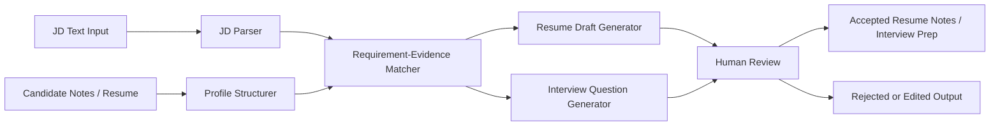

# AI Job Application Agent / AI Career Interview System

## Overview

An AI-assisted job application workflow that parses job descriptions, structures candidate experience, drafts resume improvements, and prepares interview practice while keeping the user in the review loop.

## Motivation

Job seekers often have scattered project notes, different job descriptions, and limited time to tailor resumes or prepare interviews. The useful engineering problem is not only generating text, but turning career material into structured, traceable, and editable steps: parse the JD, map requirements to real evidence, draft suggestions, and require human confirmation before anything is reused.

## Features

- JD parsing into responsibilities, hard skills, soft skills, seniority signals, and keyword groups.
- Candidate profile structuring across education, projects, skills, achievements, and constraints.
- JD-to-candidate matching matrix that highlights strong evidence, weak evidence, and missing evidence.
- Resume bullet generation or rewrite suggestions grounded in user-provided experience.
- Interview question generation based on the JD, project evidence, and likely follow-up topics.
- Human-in-the-loop review before final resume or interview output is accepted.
- Output guardrails to avoid fabricating experience, exaggerating impact, or making unsupported claims.
- Public documentation boundary that separates workflow design from private resume data and prompts.

## Tech Stack

This public case study is a documentation and architecture artifact. It does not claim a complete public implementation.

| Area | Current / Intended Technology |
|---|---|
| Documentation | Markdown, Mermaid |
| Workflow design | LLM application decomposition, prompt workflow design, human review checkpoints |
| Data contracts | JSON-style schemas for JD fields, candidate profile fields, match results, and generated drafts |
| Resume output | LaTeX / Markdown resume draft format, depending on final implementation |
| Backend direction | Python or Node.js API service in a future public implementation |
| Testing direction | Fixture-based prompt tests, schema validation, regression checks for hallucination-prone outputs |

## Architecture



### Module Notes

- `JD Parser`: extracts role requirements, technologies, responsibilities, and evaluation signals.
- `Profile Structurer`: normalizes candidate experience into reusable evidence blocks.
- `Requirement-Evidence Matcher`: maps JD requirements to candidate evidence and identifies gaps.
- `Draft Generator`: creates resume bullet suggestions and interview practice prompts.
- `Review Layer`: requires the user to edit, accept, or reject model-generated content.

## Project Structure

```text
ai-career-interview-system/
├── README.md          # Public engineering case study
├── .env.example       # Safe placeholder environment configuration
└── assets/            # Demo screenshots or GIFs to be added later
```

## Getting Started

This case study can be reviewed locally as documentation:

```bash
git clone https://github.com/Wendy-James/project-briefs.git
cd project-briefs/case-studies/ai-career-interview-system
open README.md
```

If this becomes a public implementation later, the first runnable target should be a small API or CLI that accepts a sample JD and a mock candidate profile, then produces a structured match report.

## Environment Variables

No real credentials are required for this public brief. Use `.env.example` only as a safe template for a future implementation.

```bash
cp .env.example .env
```

Never commit a real model API key, private resume, or interview transcript.

## Testing

Current public artifact:

```bash
# From the repository root, run whichever Markdown checker is available locally.
markdownlint case-studies/ai-career-interview-system/README.md
```

Recommended implementation tests:

- Schema validation for parsed JD fields and candidate profile fields.
- Fixture tests for common JD formats and noisy job descriptions.
- Guardrail tests that reject unsupported resume claims.
- Snapshot tests for resume bullet drafts and interview question formats.
- Manual review checklist for factuality, tone, and privacy.

## Demo

- Screenshot: `assets/demo-screenshot.png` (to be added)
- GIF: `assets/workflow-demo.gif` (to be added)
- Current demo status: this folder documents the intended workflow and public disclosure boundary; runnable UI/API demo is future work.

## My Role

Wendy / 詹文婷 designed the workflow decomposition and public case-study structure: JD parsing, candidate evidence modeling, matching logic, resume draft review, interview preparation flow, and disclosure boundaries. This README intentionally avoids claiming enterprise ATS integration, production traffic, or guaranteed interview outcomes.

## Future Improvements

- Add mock input/output examples for JD parsing, candidate profile structuring, and match reports.
- Implement a minimal CLI or API service with JSON schemas and fixture tests.
- Add a resume template renderer with LaTeX or Markdown output.
- Add a small review UI for accepting, editing, or rejecting generated suggestions.
- Add screenshots and a short workflow GIF using fully synthetic data.
